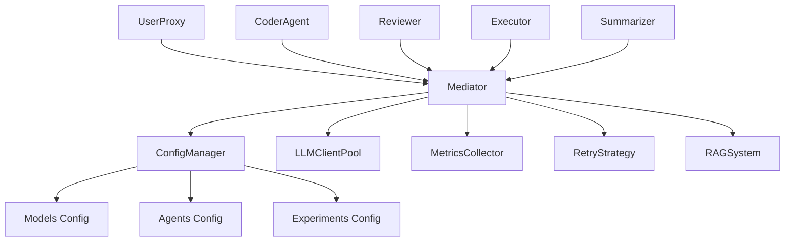

# CircuitMind-Lite 开发指南

## 🏗️ 系统架构概览

CircuitMind-Lite 采用**多智能体协作架构**，通过消息传递实现松耦合的组件交互。



### 核心组件说明

| 组件 | 职责 | 文件位置 |
|------|------|----------|
| **Mediator** | 消息路由和状态管理 | `mediator.py` |
| **BaseAgent** | 智能体基类和通用功能 | `agent_base.py` |
| **ConfigManager** | 配置管理和模型切换 | `src/config/` |
| **LLMClientPool** | LLM 客户端池化管理 | `utils/llm_client_pool.py` |
| **MetricsCollector** | 指标收集和监控 | `utils/metrics.py` |
| **RetryStrategy** | 智能重试策略 | `utils/retry_strategy.py` |

## 🤖 智能体开发

### 创建新智能体

#### 1. 基础智能体

```python
# agents/my_agent.py
from agent_base import BaseAgent
from typing import Dict, Any

class MyAgent(BaseAgent):
    def __init__(self, name: str, mediator, config):
        super().__init__(name, mediator, config, role="my_custom_role")
        
        # 注册消息处理器
        self.register_message_handlers()
        
        # 初始化自定义属性
        self.custom_state = {}
    
    def register_message_handlers(self):
        """注册消息处理器"""
        self.register_message_handler("custom_message", self._handle_custom_message)
        self.register_message_handler("data_request", self._handle_data_request)
    
    def _handle_custom_message(self, message: Dict[str, Any], sender: str = None):
        """处理自定义消息"""
        content = message.get("content", "")
        self._log("info", f"Received custom message: {content}")
        
        # 处理逻辑
        result = self.process_custom_logic(content)
        
        # 发送响应
        self.send_message([sender], {
            "type": "custom_response",
            "content": result
        })
    
    def _handle_data_request(self, message: Dict[str, Any], sender: str = None):
        """处理数据请求"""
        # 实现数据处理逻辑
        pass
    
    def process_custom_logic(self, input_data: str) -> str:
        """自定义业务逻辑"""
        # 实现你的核心逻辑
        return f"Processed: {input_data}"
```

#### 2. 状态机智能体

```python
# agents/stateful_agent.py
from agent_base import StateMachineAgent
from transitions import State

class StatefulAgent(StateMachineAgent):
    # 定义状态
    states = [
        State(name='idle'),
        State(name='processing'),
        State(name='waiting'),
        State(name='complete'),
        State(name='error')
    ]
    
    # 定义状态转换
    transitions = [
        {'trigger': 'start_processing', 'source': 'idle', 'dest': 'processing'},
        {'trigger': 'process_complete', 'source': 'processing', 'dest': 'waiting'},
        {'trigger': 'receive_data', 'source': 'waiting', 'dest': 'complete'},
        {'trigger': 'handle_error', 'source': '*', 'dest': 'error'},
        {'trigger': 'reset', 'source': '*', 'dest': 'idle'}
    ]
    
    def __init__(self, name: str, mediator, config):
        super().__init__(
            name=name,
            mediator=mediator,
            config=config,
            states=self.states,
            transitions=self.transitions,
            initial_state='idle',
            role="stateful"
        )
        
        # 设置状态机钩子
        self.machine.on_enter_processing('start_processing_action')
        self.machine.on_enter_complete('complete_action')
        
        self.register_message_handlers()
    
    def start_processing_action(self):
        """进入处理状态时的动作"""
        self._log("info", "Started processing")
        # 实现处理逻辑
        self.safe_trigger('process_complete')
    
    def complete_action(self):
        """完成状态时的动作"""
        self._log("info", "Processing completed")
        # 发送完成通知
        self.send_message(["UserProxy"], {
            "type": "task_completed",
            "content": "Task finished successfully"
        })
```

### 智能体集成

在主程序中集成新智能体：

```python
# main_new.py 中的 create_agents 方法
def create_agents(self, config, rag_tool) -> Dict[str, Any]:
    mediator = Mediator()
    
    agents = {
        "user_proxy": UserProxy("UserProxy", mediator, config),
        "coder_agent": CoderAgent("CoderAgent", mediator, config, rag_tool),
        "reviewer": Reviewer("Reviewer", mediator, config, rag_tool),
        "executor": Executor("Executor", mediator, config),
        "summarizer": Summarizer("Summarizer", mediator, config),
        
        # 添加你的新智能体
        "my_agent": MyAgent("MyAgent", mediator, config),
        "stateful_agent": StatefulAgent("StatefulAgent", mediator, config)
    }
    
    # 注册到指标系统
    for name, agent in agents.items():
        self.metrics.record_agent_activity(name, "initialized", role=getattr(agent, 'role', 'unknown'))
    
    return agents
```

## 🔧 核心组件扩展

### 扩展配置系统

#### 添加新配置类型

```python
# src/config/models.py
from dataclasses import dataclass

@dataclass
class MyCustomConfig:
    """自定义配置类"""
    custom_param: str = "default_value"
    enable_feature: bool = False
    threshold: float = 0.5
    options: List[str] = field(default_factory=lambda: ["option1", "option2"])

# 在 AppConfig 中添加
@dataclass
class AppConfig:
    # ... 现有字段
    my_custom: MyCustomConfig = field(default_factory=MyCustomConfig)
```

#### 扩展配置加载器

```python
# src/config/loaders.py
class ConfigLoader:
    def load_custom_config(self, name: str) -> Dict[str, Any]:
        """加载自定义配置"""
        return self.load_yaml(f"custom/{name}.yaml")
    
    def _build_app_config(self, config_data: Dict[str, Any], models: Dict[str, ModelConfig], current_env_name: str) -> AppConfig:
        # ... 现有逻辑
        
        # 添加自定义配置
        custom_config = MyCustomConfig(**config_data.get("my_custom", {}))
        
        return AppConfig(
            # ... 现有参数
            my_custom=custom_config
        )
```

### 扩展消息系统

#### 定义新消息类型

```python
# utils/message_types.py
from enum import Enum

class MessageType(Enum):
    # ... 现有消息类型
    CUSTOM_DATA = "custom_data"
    ANALYSIS_REQUEST = "analysis_request"
    WORKFLOW_START = "workflow_start"
    BATCH_PROCESS = "batch_process"

# 在智能体中使用
class MyAgent(BaseAgent):
    MSG_TYPE_CUSTOM_DATA = "custom_data"
    MSG_TYPE_ANALYSIS_REQUEST = "analysis_request"
    
    def register_message_handlers(self):
        self.register_message_handler(self.MSG_TYPE_CUSTOM_DATA, self._handle_custom_data)
        self.register_message_handler(self.MSG_TYPE_ANALYSIS_REQUEST, self._handle_analysis)
```

#### 实现消息中间件

```python
# utils/message_middleware.py
from typing import Dict, Any

class CustomMessageMiddleware:
    """自定义消息中间件"""
    
    def __init__(self):
        self.message_count = 0
        self.filtered_messages = 0
    
    def process_message(self, sender: str, receivers: List[str], message: Dict[str, Any]) -> bool:
        """处理消息，返回 True 继续传递，False 过滤掉"""
        self.message_count += 1
        
        # 示例：过滤特定类型的消息
        if message.get("type") == "debug" and not self._should_allow_debug():
            self.filtered_messages += 1
            return False
        
        # 示例：消息转换
        if message.get("type") == "legacy_format":
            message = self._convert_legacy_message(message)
        
        return True
    
    def _should_allow_debug(self) -> bool:
        """判断是否允许调试消息"""
        # 实现你的逻辑
        return True
    
    def _convert_legacy_message(self, message: Dict[str, Any]) -> Dict[str, Any]:
        """转换遗留格式消息"""
        # 实现格式转换
        return message

# 在 Mediator 中集成
class Mediator:
    def __init__(self):
        # ... 现有初始化
        self.middlewares = [CustomMessageMiddleware()]
    
    def send_message(self, sender: str, receivers: List[str], message: Any):
        # 应用中间件
        for middleware in self.middlewares:
            if not middleware.process_message(sender, receivers, message):
                return  # 消息被过滤
        
        # 继续原有逻辑
        for receiver in receivers:
            # ...
```

### 扩展指标系统

#### 添加自定义指标

```python
# utils/custom_metrics.py
from utils.metrics import get_metrics_collector
from typing import Dict, Any
import time

class CustomMetrics:
    """自定义指标收集器"""
    
    def __init__(self):
        self.base_metrics = get_metrics_collector()
        self.custom_counters = {}
        self.custom_timers = {}
    
    def record_custom_event(self, event_name: str, metadata: Dict[str, Any] = None):
        """记录自定义事件"""
        self.base_metrics.set_custom_metric("events", event_name, {
            "timestamp": time.time(),
            "metadata": metadata or {}
        })
    
    def start_timer(self, timer_name: str) -> str:
        """开始计时"""
        timer_id = f"{timer_name}_{int(time.time() * 1000)}"
        self.custom_timers[timer_id] = time.time()
        return timer_id
    
    def end_timer(self, timer_id: str) -> float:
        """结束计时并返回持续时间"""
        if timer_id not in self.custom_timers:
            return 0.0
        
        duration = time.time() - self.custom_timers[timer_id]
        del self.custom_timers[timer_id]
        
        # 记录到指标系统
        timer_name = timer_id.split('_')[0]
        self.base_metrics.set_custom_metric("timers", timer_name, duration)
        
        return duration
    
    def increment_counter(self, counter_name: str, value: int = 1):
        """增加计数器"""
        self.base_metrics.increment_custom_counter("counters", counter_name, value)

# 使用装饰器自动记录指标
def track_performance(metric_name: str = None):
    """性能跟踪装饰器"""
    def decorator(func):
        def wrapper(*args, **kwargs):
            metrics = CustomMetrics()
            timer_id = metrics.start_timer(metric_name or func.__name__)
            
            try:
                result = func(*args, **kwargs)
                metrics.record_custom_event(f"{func.__name__}_success")
                return result
            except Exception as e:
                metrics.record_custom_event(f"{func.__name__}_error", {"error": str(e)})
                raise
            finally:
                duration = metrics.end_timer(timer_id)
                print(f"{func.__name__} took {duration:.2f}s")
        
        return wrapper
    return decorator

# 使用示例
@track_performance("code_generation")
def generate_complex_code(requirements: str) -> str:
    # 复杂的代码生成逻辑
    time.sleep(2)  # 模拟处理时间
    return "generated code"
```

### 扩展重试策略

#### 自定义重试策略

```python
# utils/custom_retry.py
from utils.retry_strategy import RetryStrategy, RetryConfig, BackoffStrategy, RetryErrorType
from enum import Enum

class CustomErrorType(Enum):
    """自定义错误类型"""
    CUSTOM_API_ERROR = "custom_api_error"
    WORKFLOW_ERROR = "workflow_error"
    DATA_VALIDATION_ERROR = "data_validation_error"

class CustomRetryStrategy(RetryStrategy):
    """扩展重试策略"""
    
    def __init__(self):
        super().__init__()
        
        # 添加自定义错误类型的策略
        self.strategies.update({
            CustomErrorType.CUSTOM_API_ERROR: RetryConfig(
                max_retries=5,
                backoff_strategy=BackoffStrategy.EXPONENTIAL,
                base_delay=2.0,
                max_delay=60.0,
                escalation_factor=1.5
            ),
            CustomErrorType.WORKFLOW_ERROR: RetryConfig(
                max_retries=2,
                backoff_strategy=BackoffStrategy.LINEAR,
                base_delay=5.0
            ),
            CustomErrorType.DATA_VALIDATION_ERROR: RetryConfig(
                max_retries=1,
                backoff_strategy=BackoffStrategy.NONE
            )
        })
    
    def should_retry_with_context(self, error_type, attempt_count: int, context: Dict[str, Any]) -> bool:
        """基于上下文的重试决策"""
        base_should_retry = super().should_retry(error_type, attempt_count)
        
        if not base_should_retry:
            return False
        
        # 自定义重试逻辑
        if error_type == CustomErrorType.CUSTOM_API_ERROR:
            # 检查是否是特定的 API 错误
            if context.get("api_status") == 429:  # Rate limit
                return True
            elif context.get("api_status") in [500, 502, 503]:  # Server errors
                return True
            elif context.get("api_status") == 401:  # Auth error
                return False  # 不重试认证错误
        
        return base_should_retry

# 在智能体中使用自定义重试策略
class MyAgent(BaseAgent):
    def __init__(self, name: str, mediator, config):
        super().__init__(name, mediator, config)
        self.custom_retry = CustomRetryStrategy()
    
    def call_external_api(self, api_endpoint: str, data: Dict[str, Any]) -> Dict[str, Any]:
        """调用外部 API 并使用自定义重试"""
        def api_call():
            # 实现 API 调用逻辑
            response = make_api_request(api_endpoint, data)
            if response.status_code != 200:
                raise CustomAPIError(f"API call failed: {response.status_code}")
            return response.json()
        
        return self.custom_retry.execute_with_retry(
            api_call,
            CustomErrorType.CUSTOM_API_ERROR,
            f"api_call_{api_endpoint}",
            context={"endpoint": api_endpoint}
        )
```

## 🧪 测试开发

### 单元测试

```python
# tests/test_agents.py
import pytest
from unittest.mock import Mock, patch
from agents.coder_agent import CoderAgent

class TestCoderAgent:
    @pytest.fixture
    def mock_config(self):
        config = Mock()
        config.agent_system_messages = {"CoderAgent": "Test system message"}
        config.rag = Mock()
        config.rag.enabled = False
        return config
    
    @pytest.fixture
    def mock_mediator(self):
        return Mock()
    
    @pytest.fixture
    def coder_agent(self, mock_mediator, mock_config):
        with patch('agents.coder_agent.get_config_manager'), \
             patch('agents.coder_agent.ChatSession'):
            return CoderAgent("TestCoder", mock_mediator, mock_config, None)
    
    def test_analyze_design_requirements(self, coder_agent):
        """测试设计需求分析"""
        requirements = "Design a simple NOT gate"
        
        with patch.object(coder_agent, 'get_llm_response') as mock_llm:
            mock_llm.return_value = '{"needs_flip_flop": false, "reason": "Simple combinational logic"}'
            
            result = coder_agent.analyze_design_requirements(requirements)
            
            assert isinstance(result, dict)
            assert "needs_flip_flop" in result
            assert result["needs_flip_flop"] is False
    
    def test_state_transitions(self, coder_agent):
        """测试状态机转换"""
        assert coder_agent.state == "idle"
        
        # 测试正常状态转换
        coder_agent.design_received()
        assert coder_agent.state == "generating_code"
        
        coder_agent.code_generated()
        assert coder_agent.state == "running_simulation"
    
    def test_message_handling(self, coder_agent):
        """测试消息处理"""
        test_message = {
            "type": "design_request",
            "content": "Design a NOT gate"
        }
        
        with patch.object(coder_agent, '_handle_design_request') as mock_handler:
            coder_agent.receive_message("TestSender", test_message)
            mock_handler.assert_called_once_with(test_message, "TestSender")

# tests/test_config.py
class TestConfigManager:
    def test_model_switching(self):
        """测试模型切换"""
        from src.config import get_config_manager
        
        config_manager = get_config_manager()
        original_model = config_manager.config.current_model
        
        # 切换到测试模型
        config_manager.switch_model("test_model")
        assert config_manager.config.current_model == "test_model"
        
        # 恢复原始模型
        config_manager.switch_model(original_model)
    
    def test_config_validation(self):
        """测试配置验证"""
        from src.config.validators import ConfigValidator, ConfigValidationError
        from src.config.models import AppConfig, ModelConfig, APIConfig
        
        validator = ConfigValidator()
        
        # 测试有效配置
        valid_config = AppConfig(
            current_model="test_model",
            models={
                "test_model": ModelConfig(
                    name="test_model",
                    api_config=APIConfig(
                        api_keys=["test_key"],
                        base_url="https://api.example.com/v1"
                    )
                )
            }
        )
        
        # 应该不抛出异常
        validator.validate(valid_config)
        
        # 测试无效配置
        invalid_config = AppConfig(
            current_model="nonexistent_model",
            models={}
        )
        
        with pytest.raises(ConfigValidationError):
            validator.validate(invalid_config)
```

### 集成测试

```python
# tests/test_integration.py
import tempfile
import os
from pathlib import Path

class TestExperimentFlow:
    @pytest.fixture
    def temp_experiment_dir(self):
        """创建临时实验目录"""
        with tempfile.TemporaryDirectory() as temp_dir:
            exp_dir = Path(temp_dir) / "test_experiment"
            exp_dir.mkdir()
            
            # 创建必需文件
            (exp_dir / "test_Prompt.txt").write_text(
                "Design a simple NOT gate with input 'a' and output 'out'"
            )
            
            (exp_dir / "testbench.v").write_text("""
                module testbench;
                    reg a;
                    wire out, expected_out;
                    
                    not_gate uut (.a(a), .out(out));
                    not_gate_ref ref (.a(a), .out(expected_out));
                    
                    initial begin
                        a = 0; #10;
                        a = 1; #10;
                        if (out === expected_out)
                            $display("All tests passed");
                        else
                            $display("Test failed");
                        $finish;
                    end
                endmodule
            """)
            
            (exp_dir / "not_gate_ref.v").write_text("""
                module not_gate_ref (
                    input a,
                    output out
                );
                    not g1 (out, a);
                endmodule
            """)
            
            yield str(exp_dir)
    
    def test_complete_experiment_flow(self, temp_experiment_dir):
        """测试完整实验流程"""
        from main_optimized import ExperimentRunner
        from src.config import get_config_manager
        
        config_manager = get_config_manager()
        runner = ExperimentRunner(config_manager, max_workers=1)
        
        # 设置实验环境
        env_info = runner.setup_environment(temp_experiment_dir)
        assert env_info is not None
        
        # 运行实验
        result = runner.process_single_experiment(env_info)
        
        # 验证结果
        assert result is not None
        assert "experiment_name" in result
        assert "success" in result
```

### 性能测试

```python
# tests/test_performance.py
import time
import pytest
from utils.llm_client_pool import get_llm_client_pool
from utils.metrics import get_metrics_collector

class TestPerformance:
    def test_client_pool_performance(self):
        """测试客户端池性能"""
        pool = get_llm_client_pool()
        
        # 模拟模型配置
        mock_config = Mock()
        mock_config.api_key = "test_key"
        mock_config.base_url = "https://api.example.com/v1"
        
        # 测试客户端创建时间
        start_time = time.time()
        for _ in range(10):
            client = pool.get_client(mock_config)
        creation_time = time.time() - start_time
        
        # 应该很快完成（复用现有客户端）
        assert creation_time < 1.0
    
    def test_metrics_collection_overhead(self):
        """测试指标收集开销"""
        metrics = get_metrics_collector()
        
        # 测试大量指标记录的性能
        start_time = time.time()
        for i in range(1000):
            metrics.record_custom_event(f"test_event_{i}", {"data": i})
        
        collection_time = time.time() - start_time
        
        # 指标收集应该很快
        assert collection_time < 2.0
        
        # 验证所有事件都被记录
        stats = metrics.get_system_summary()
        assert stats["total_events"] >= 1000
```

## 🚀 部署指南

### Docker 部署

```dockerfile
# Dockerfile
FROM python:3.9-slim

# 安装系统依赖
RUN apt-get update && apt-get install -y \
    iverilog \
    gtkwave \
    && rm -rf /var/lib/apt/lists/*

# 设置工作目录
WORKDIR /app

# 复制依赖文件
COPY requirements.txt .
RUN pip install --no-cache-dir -r requirements.txt

# 复制应用代码
COPY . .

# 运行兼容性修复
RUN python compatibility_fixes.py

# 暴露端口（如果需要）
EXPOSE 8000

# 设置入口点
ENTRYPOINT ["python", "main_new.py"]
```

```yaml
# docker-compose.yml
version: '3.8'

services:
  circuitmind:
    build: .
    volumes:
      - ./configs:/app/configs
      - ./experiments_output:/app/experiments_output
      - ./TC:/app/TC
    environment:
      - ENVIRONMENT=production
    command: ["-e", "production", "-w", "4"]

  ollama:
    image: ollama/ollama
    ports:
      - "11434:11434"
    volumes:
      - ollama_data:/root/.ollama

volumes:
  ollama_data:
```

### 监控集成

```python
# utils/monitoring.py
import logging
from typing import Dict, Any
import json
import requests

class MonitoringIntegration:
    """监控系统集成"""
    
    def __init__(self, webhook_url: str = None):
        self.webhook_url = webhook_url
        self.logger = logging.getLogger(__name__)
    
    def send_alert(self, level: str, message: str, metadata: Dict[str, Any] = None):
        """发送告警"""
        alert_data = {
            "timestamp": time.time(),
            "level": level,
            "message": message,
            "metadata": metadata or {},
            "service": "CircuitMind-Lite"
        }
        
        if self.webhook_url:
            try:
                response = requests.post(
                    self.webhook_url,
                    json=alert_data,
                    timeout=10
                )
                response.raise_for_status()
            except Exception as e:
                self.logger.error(f"Failed to send alert: {e}")
        
        # 记录到本地日志
        self.logger.warning(f"ALERT [{level}]: {message}")
    
    def setup_metrics_monitoring(self):
        """设置指标监控"""
        from utils.metrics import get_metrics_collector
        
        metrics = get_metrics_collector()
        
        def alert_callback(event):
            if event["type"] == "error_occurred":
                self.send_alert(
                    "error",
                    f"Error in {event['data'].get('experiment_name', 'unknown')}",
                    event["data"]
                )
            elif event["type"] == "experiment_end" and not event["data"]["success"]:
                self.send_alert(
                    "warning",
                    f"Experiment failed: {event['data']['experiment_name']}",
                    event["data"]
                )
        
        metrics.subscribe(alert_callback)

# 在主程序中集成
monitoring = MonitoringIntegration(webhook_url=os.getenv("WEBHOOK_URL"))
monitoring.setup_metrics_monitoring()
```

## 📚 最佳实践

### 代码质量

1. **类型注解**: 所有公共方法都应该有完整的类型注解
2. **文档字符串**: 使用 Google 风格的文档字符串
3. **错误处理**: 使用统一的异常系统
4. **日志记录**: 结构化日志，包含足够的上下文信息
5. **测试覆盖**: 核心功能应该有单元测试和集成测试

### 性能优化

1. **客户端复用**: 使用 LLM 客户端池避免重复创建
2. **并发处理**: 合理使用并行执行提升效率
3. **缓存策略**: 对计算结果和配置进行适当缓存
4. **资源清理**: 及时清理不再需要的资源
5. **监控指标**: 持续监控性能指标并优化瓶颈

### 安全考虑

1. **API 密钥管理**: 不要硬编码 API 密钥，使用环境变量或配置文件
2. **输入验证**: 验证所有外部输入，防止注入攻击
3. **权限控制**: 最小权限原则，只授予必要的文件系统访问权限
4. **日志脱敏**: 避免在日志中记录敏感信息
5. **依赖安全**: 定期更新依赖库，修复安全漏洞

### 扩展指导

1. **模块化设计**: 新功能应该作为独立模块开发
2. **接口一致性**: 遵循现有的接口设计模式
3. **配置驱动**: 通过配置文件控制行为，避免硬编码
4. **向后兼容**: 新版本应该保持向后兼容性
5. **文档同步**: 代码变更后及时更新文档

这个开发指南提供了扩展 CircuitMind-Lite 系统的完整指导，涵盖了从简单的智能体开发到复杂的系统集成。遵循这些指导原则可以确保扩展功能与现有系统保持一致性和高质量。