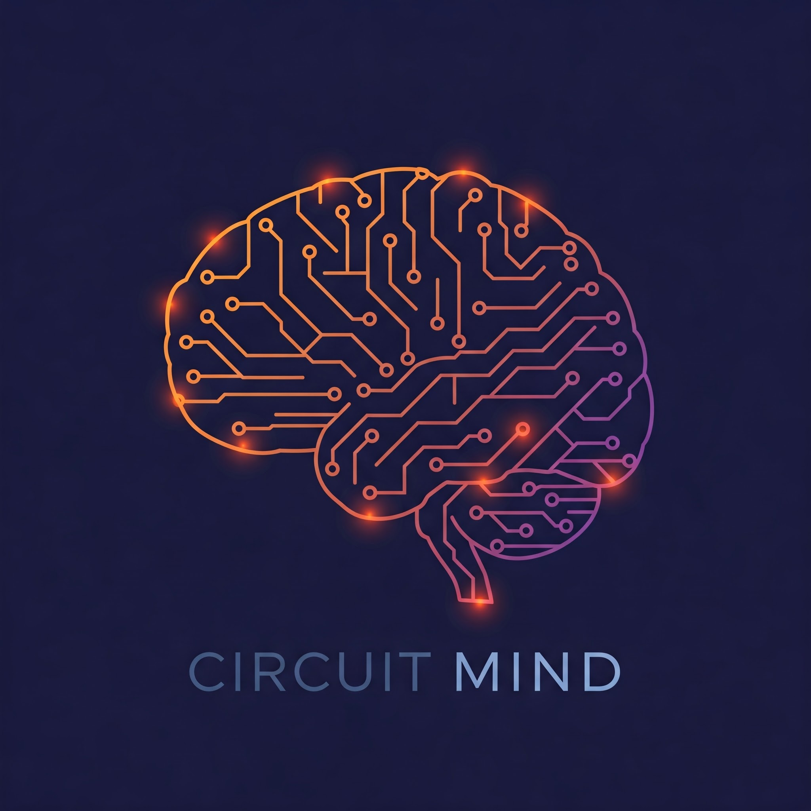

<div align="center">
  
  <div>&nbsp;</div>
  <h1>CircuitMind: Achieving Optimal Circuit Generation through Multi-Agent Collaboration</h1>
  <div>&nbsp;</div>

  English | [简体中文](README-CN.md)

  <div>&nbsp;</div>

  <a href="https://huggingface.co/datasets/hyq001/TC-Bench">
    
  </a>
  <a href="https://github.com/BUAA-CLab/CircuitMind/tree/main/TC-Bench">
    
  </a>
  <a href="https://github.com/BUAA-CLab/CircuitMind">
     
  </a>

  <div>&nbsp;</div>

  [](https://github.com/BUAA-CLab/CircuitMind/blob/main/LICENSE)
  [](https://www.python.org/) <div>&nbsp;</div>

  [📚 Framework README](https://github.com/BUAA-CLab/CircuitMind/blob/main/CircuitMind/README.md) |
  [💾 TC-Bench Dataset README](https://github.com/BUAA-CLab/CircuitMind/blob/main/TC-Bench/README.md) |
  [📝 Paper](https://arxiv.org/pdf/2504.14625v3) |
  [🐛 Report Issues](https://github.com/BUAA-CLab/CircuitMind/issues/new/choose)

</div>

-----

## Table of Contents

* [Introduction](#introduction)
* [Key Achievements](#key-achievements)
* [Repository Contents](#repository-contents)
    * [TC-Bench Test Suite & Evaluation Tools](#tc-bench-test-suite--evaluation-tools)
    * [CircuitMind Framework](#circuitmind-framework)
* [Open Source Plan (To-Do List)](#open-source-plan-to-do-list)
* [Read Our Paper](#read-our-paper)
* [Citation](#citation)
* [License](#license)

-----
<div id="introduction"></div>

## Introduction

CircuitMind is a multi-agent framework designed to overcome the efficiency limitations of Large Language Models (LLMs) in gate-level hardware design. While LLMs excel at code generation, their application in circuit design often results in gate counts far exceeding those of human expert designs. This "Boolean optimization barrier" stems from the limitations of LLMs in structured reasoning and global optimization required for efficient gate-level design.

Our work proposes CircuitMind, a novel hierarchical multi-agent system that achieves efficiency comparable to human experts through three key innovations:

1.  **Syntax Locking (SL):** Constrains generation to fundamental logic gates (AND, OR, NOT, XOR, NAND), forcing true Boolean optimization at the netlist level.
2.  **Retrieval-Augmented Generation (RAG):** Enables knowledge-driven design by retrieving and reusing optimized sub-circuit patterns from a dynamic knowledge base.
3.  **Dual-Reward Optimization (DR):** Balances functional correctness with physical efficiency (gate count, delay) through targeted feedback loops.

To evaluate our approach, we introduce TC-Bench, the first gate-level benchmark leveraging collective intelligence from the [TuringComplete game](https://turingcomplete.game/). Based on thousands of competitively optimized human designs, TC-Bench provides metrics and performance tiers aligned with human-level proficiency.

<div id="key-achievements"></div>

## Key Achievements

* CircuitMind enables a significant portion (**55.6%**) of model implementations to achieve or surpass the efficiency levels of top human experts on TC-Bench.
* Our framework demonstrates its ability to elevate mid-sized models to outperform larger models and match top-tier human expert performance without specialized training.
* Significant improvements in Solution Efficiency Index (SEI) are observed across various LLMs, demonstrating the effectiveness of our collaborative approach in overcoming the Boolean optimization barrier.

-----
<div id="repository-contents"></div>

## Repository Contents

This repository contains the open-source code, models, and data for CircuitMind and TC-Bench. It primarily consists of two parts:

<div id="tc-bench-test-suite--evaluation-tools"></div>

### TC-Bench Test Suite & Evaluation Tools

This directory contains the complete TC-Bench benchmark dataset for evaluation.

* The dataset is organized into three difficulty levels: `Easy`, `Medium`, and `Hard`, with subfolders for each problem (problem description, test code, reference solutions).
* **Notably, this directory also includes performance evaluation tools**, allowing you to compare the performance of generated circuits (using metrics like SEI) against established human expert tiers.
* Detailed information about the dataset structure and the use of evaluation tools can be found in the **[README file within the TC-Bench directory](https://github.com/BUAA-CLab/CircuitMind/blob/main/TC-Bench/README.md)**.
* **[Click here to browse the TC-Bench dataset and tools](https://github.com/BUAA-CLab/CircuitMind/tree/main/TC-Bench)**

<div id="circuitmind-framework"></div>

### CircuitMind Framework

This directory contains the source code for the CircuitMind multi-agent framework.

* Instructions on how to set up, configure, and run the CircuitMind framework can be found in the README file within this directory.
* **[Click here to view the CircuitMind code and usage instructions](https://github.com/BUAA-CLab/CircuitMind/blob/main/CircuitMind/README.md)**

-----
<div id="open-source-plan-to-do-list"></div>

## Open Source Plan (To-Do List)

- ✅ **TC-Bench Test Suite & Evaluation Tools** - Released!
- [ ] **CircuitMind Multi-Agent Framework** - To be released soon after paper acceptance. Stay tuned!

-----
<div id="read-our-paper"></div>

## Read Our Paper

Read our paper for more details: [Paper](https://arxiv.org/pdf/2504.14625v3)

<div id="citation"></div>

## Citation

If this work is useful for your research, please cite our paper:

```bibtex
@article{qin2025towards,
  title={Towards Optimal Circuit Generation: Multi-Agent Collaboration Meets Collective Intelligence},
  author={Qin, Haiyan and Feng, Jiahao and Feng, Xiaotong and Xing, Wei W and Kang, Wang},
  journal={arXiv preprint arXiv:2504.14625},
  year={2025}
}
```

## License

This project is licensed under the Apache License 2.0 - see the LICENSE file for details.

